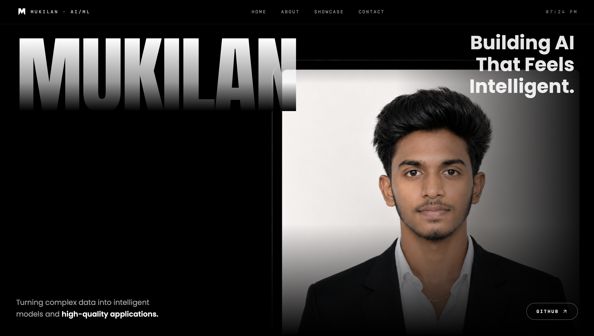

  <h1>Mukilan S • AI/ML & Full-Stack Developer</h1>
  
Building production-ready ML models & intelligent full-stack apps.

   
  
    
  
  
  
  
  
  

## 🚀 About Me
I am an **Artificial Intelligence and Machine Learning** student at Rajalakshmi Engineering College. I specialize in Python, PyTorch, LangGraph, and full-stack development with React and Next.js. My focus is on turning complex data into intelligent models and crafting highly interactive, high-quality web applications.

## 🛠 Skills & Technologies

### AI & Machine Learning

### Full-Stack Development

### Database & Operations

## ✨ Key Features of This Portfolio
- **Immersive 3D Experiences:** Powered by React Three Fiber and Drei.
- **Fluid Animations:** Complex layout animations driven by Framer Motion.
- **Responsive Design:** Mobile-first approach using Tailwind CSS.
- **Performance Optimized:** Fast bundling and HMR with Vite.

## 📬 Let's Connect
- **LinkedIn:** [Mukilan S](https://www.linkedin.com/in/mukilan-s2486/)
- **GitHub:** [Mukilan-s18](https://github.com/Mukilan-s18)
- **Live Site:** [mukilans.vercel.app](https://mukilans.vercel.app)

